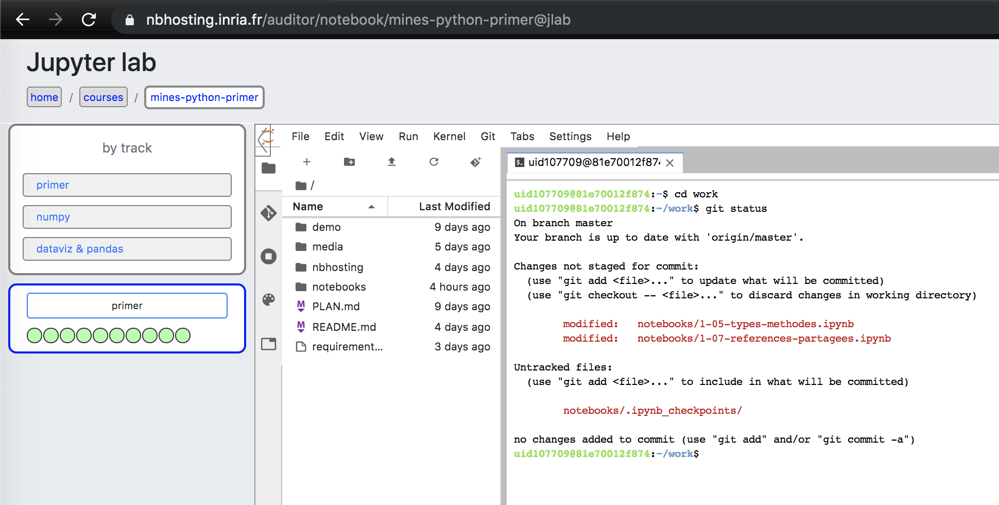
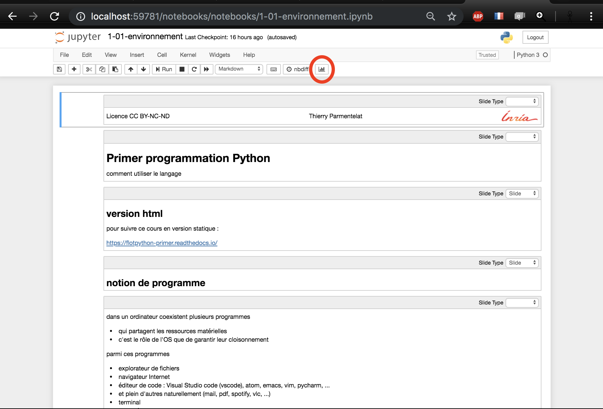
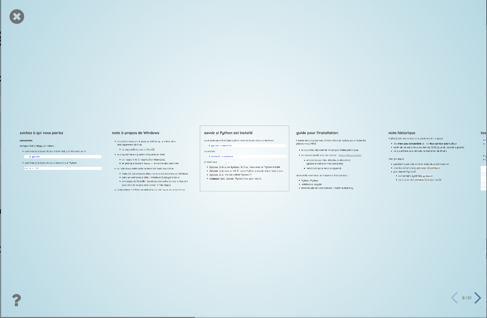

# notebooks

Le cours est exclusivement écrit en notebooks sous forme de slides. 

Remarquez également la présence de notes qui approfondissent les slides; ces notes n'apparaissent pas à l'écran dans la vue 'slide' standard, on les voit apparaitre dans dans la sortie html, ainsi que dans la vue orateur (voir 'visionneuse').

Pour utiliser les notebooks, deux options :

* installation Jupyter locale
* utilisation à distance sur nbhosting

Dans l'esprit de la prise d'autonomie, c'est la première option qui est recommandée à terme.

Toutefois la plateforme nbhosting est disponible en guise de secours, notamment au début du cours, pour permettre de suivre les cours sans installation locale préalable.

Notez également la présence d'une version statique en html, voir la dernière section. 

# installation locale

Par rapport à une installation Python standard, plusieurs niveaux de dépendances doivent être envisagés

## dépendances dures

A minima, pour exécuter les notebooks de ce cours vous devez installer quelques bibliothèques; pour cela la méthode la plus simple consiste à faire 

```bash
pip install -r requirements.txt
```

## confort

Dans les slides on utilise fréquemment une extension jupyter qui s'appelle `splitcell`; elle permet d'avoir des cellules qui prennent une demie largeur, pour mieux utliser l'espace sur les slides, pour l'activer :

```bash
jupyter nbextension enable splitcell/splitcell
```

Noter que si vous avez un système de virtualenv ou d'environnement conda, il peut être utile d'ajouter cette option, afin de n'activer cette extension **que** dans votre virtualenv.

```bash
jupyter nbextension enable splitcell/splitcell --sys-prefix
```

~~Enfin la visionneuse peut être upgradée à la version 5.6, actuellement en  développement mais plus confortable :~~ (edit: ce n'est plus nécessaire, c'est pris en charge dans `requirements.txt`)

```bash
pip install -U --pre rise
```

# nbhosting

Les images docker préparées pour exécuter le cours sous nbhosting contiennent tout ce qui est nécessaire.

Par contre il faut s'attendre à un délai assez long la première fois qu'on se connecte sur un cours, ou après une période d'inactivité, le temps de recréer un container.

Il existe aussi quelques fonctionnalités spécifiques à nbhosting :

* pour passer en mode plein écran, utiliser les petites icônes en forme de `<` et de `^` dans les coins supérieurs gauche et droit respectivement de l'iframe jupyter; avec n'importe quel modifier comme `Shift` ou `Control` ces icônes changent une seule direction. 

* dans le menu Jupyter `File` il y a deux ajouts qui sont
  * *Reset to Original* : permet de revenir à la version 'prof' du notebook courant
  * *Share Static Version* : pour exposer en read-only un notebook via une URL, par exemple pour une discussion dans un forum

* **git** : pour chaque étudiant qui ouvre un cours pour la première fois, on va cloner au sens git le repo du prof; si par exemple lors d'une 2ème ou 3ème session, du contenu a été ajouté depuis le début du cours, il est donc nécessaire pour l'étudiant de **tirer** dans ce repo git.

  Pour cela actuellement il est nécessaire de passer par jupyterlab (en bas à gauche dans la vue nbhosting, sortie du mode plein écran). Deux options :

  * jupyterlab est buildé avec l'extension `jupyterlab-git` qui permet de tirer, voir les changements, les abandonner si nécessaire..
  
    

  * en ligne de commande, pour cela créer un terminal sous jupyter et aller dans `work`

    ]

  
# visionneuse de slides

Les notebooks comportant des slides démarrent en principe automatiquement en mode slide; pour aller/revenir vers le mode notebook *classic* :

* avec le clavier, utiliser 'Alt-r'  (Option-r sur MacOS)
* avec la souris
  * pour quitter le mode slide, la grosse croix en haut à gauche
  * pour entrer dans le mode slide, l'icône en forme de barchart 




Les touches cruciales :

* *`Espace`* ou *`Shift-Espace`* pour se déplacer dans les slides
* *`Shift-Enter`* pour évaluer la cellule courante
* *`Control +`* et *`Control -`* pour agrandir / rapetisser le contenu; utile pour s'adapter au contenu lorsqu'un slide est plus dense; ce sont ici les raccourcis standard du navigateur, sur MacOS faire plutôt *`Command +`* et *`Command -`*

Et aussi :

* si vous entrez par mégarde en mode édition, comme d'habitude utiliser `Escape` pour revenir en mode commande; sinon vous ne commandez plus la visionneuse, vous insérez dans la cellule courante, évidemment..
* la touche `w` permet d'accéder au mode 'overview'; utilisez les flêches pour vous déplacer dans la présentation, et tapez à nouveau `w` pour revenir au mode slide usuel



* la touche `t` permet de passer en mode 'orateur' avec deux vues distinctes, l'une pour le public et l'autre pour l'orateur; cela suppose de placer les deux vues sur des displays différents; pour en sortir fermez simplement la fenêtre de notes. C'est un setup qui peut s'avérer compliqué à mettre en place en cours. L'avantage est de voir la slide suivante.


# version html

En guise de *handouts* le contenu de ce cours est disponible en html 'statique'

https://flotpython-primer.readthedocs.io/

 évidemment cette forme vient avec toutes les cellules exécutées (à l'inverse du repo git où on ne range que des notebooks vierges, utiliser `nbstripout` pour le nettoyage)
